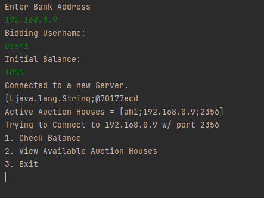
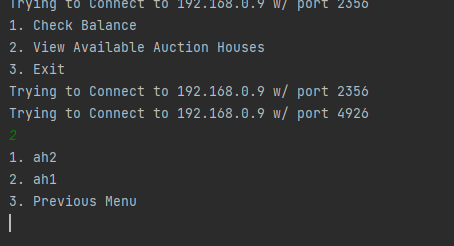
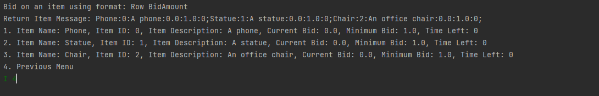

### Project 5: Auction Distribution by Fermin Ramos, Vasileios Grigorios Kourakos and Loc Tung Su
**_README.MD written by Loc Su_**

### General Description
Three program Bank, Agent, AuctionHouse, that can interact with each other through
Socket connection and complete different tasks.

1. The Bank (Bank.jar) can be considered the middle ground where it only plays as a server that connect the Agents to the AuctionHouses.

2. The AuctionHouse (AuctionHouse.jar) is play as both a Server and a Client. It is a Client to the Bank, but it is also a Server to the Client. The AuctionHouse job is reading in the Agents' request and communicate it with the Bank and 
to complete different tasks.

3. The Agent (Agent.jar) is the one that will mostly initiate all the action such as making bids, set bank balance, etc

4. The AutoBidder (AutoBidder.jar) is the same as the Agent which it does not require a human to make a bid
but it will continuously place a bid after a set amount of time.
### BIDDING Status
Four bidding status:
1. `ACCEPTED`
2. `REJECTED`
3. `OUTBID`
4. `WINNER`

`ACCEPTED` status is set when a bid is being requested, and it meets all the requirements.\
`REJECTED` status is set when a bid is being requested, and it does not meet all the requirements.\
`OUTBID` status is set when you are the current bid winner, and another agent makes a better the bid than you, your bid will be OUTBID-ED.\
`WINNER` status is set when after the 30 seconds interval has passed, and no other Agents contest your bid, you will win the bidding process.

### GUI 
_**No GUI**_

### How to run
The program can run on the same computer or through multiple computer through jar file.\
For one computer through IntelliJ
**Steps** 
1. Run the Bank.jar by left click on file -> Run jar. It will give you the host name. Copy it.
2. Run the AuctionHouse.jar by left click on file -> Run jar. It will ask you the host name which you will put the host
name provided when running the Bank.jar. You can run as much AuctionHouse instances as you want.Then input the wanted name, i.e ah1, ah2, ...
3. Run the Agent.jar by left click on file -> Run jar. It will ask you the host name which you will put the host
name provided when running the Bank.jar. You can run as much Agent instances as you want. Then input the wanted name, i.e user1, user2, ...
4. After running the Agent, you will be ask to input in the Bank Balance which will be your total money you can spend
on the bidding.
5. A menu will pop with different set of options.

6. Using the index of the option to choose the option. 1, 2 or 3.
7. When viewing the available AuctionHouses, you can choose a specific AuctionHouse base on the name of it applying step 6.

8. Choose a specific AuctionHouse, then apply step 6 to make bid with the following format bid "ItemIndex bidAmount". For example:

In the bottom, "1" is the "ItemIndex" for the first item and "4" is the "bidAmount".
9. Make sure your bid to an item has to be larger than the CurrentBid + MinimumBid to be `ACCEPTED`.

For multiple computers through terminal
**Steps**
1. After create the three java files, Bank.jar, AuctionHouse.jar and Agent.jar, for the UNM CS machine, we need to copy and paste 
it to the `BIN` location of our JDK/ZULU file. This has to be applied for all computers that are in used to run this project.
2. In the `BIN` location, where we put our Jar files, open terminal in that location for each computer.
3. Assuming we are only using 3 computers, one computer will be in charged of the Bank.jar, one for AuctionHouse.jar, one for Agent.jar.
4. Run the Bank.jar by typing `./java -jar Bank.jar` in the terminal. It will show you the host name and the port number it is using.
5. Run the AuctionHouse.jar by typing `./java -jar AuctionHouse.jar` in the terminal. It will ask you the host name which you will put the host
   name provided when running the Bank.jar. You can run as much AuctionHouse instances as you want.Then input the wanted name, i.e ah1, ah2, ...Type `exit` to
   safely disconnect.
6. Run the Agent.jar by typing `./java -jar Agent.jar` in the terminal. It will ask you the host name which you will put the host
   name provided when running the Bank.jar. You can run as much Agent instances as you want. Then input the wanted name, i.e user1, user2, ...
7. After running the Agent, you will be asked to input in the Bank Balance which will be your total money you can spend
   on the bidding.
8. A menu will pop with different set of options.
   
9. Using the index of the option to choose the option. 1, 2 or 3.
10. When viewing the available AuctionHouses, you can choose a specific AuctionHouse base on the name of it applying step 6.
    
11. Choose a specific AuctionHouse, then apply step 6 to make bid with the following format bid "ItemIndex bidAmount". For example:
    
    In the bottom, "1" is the "ItemIndex" for the first item and "4" is the "bidAmount".
12. Make sure your bid to an item has to be larger than the MinimumBid to be `ACCEPTED`.

For the AutoBidder:
1. After create the three java files, Bank.jar, AuctionHouse.jar and Agent.jar, for the UNM CS machine, we need to copy and paste
   it to the `BIN` location of our JDK/ZULU file. This has to be applied for all computers that are in used to run this project.
2. In the `BIN` location, where we put our Jar files, open terminal in that location for each computer.
3. Assuming we are only using 3 computers, one computer will be in charged of the Bank.jar, one for AuctionHouse.jar, one for Agent.jar.
4. Run the Bank.jar by typing `./java -jar Bank.jar` in the terminal. It will show you the host name and the port number it is using.
5. Run the AuctionHouse.jar by typing `./java -jar AuctionHouse.jar` in the terminal. It will ask you the host name which you will put the host
name provided when running the Bank.jar. You can run as much AuctionHouse instances as you want.Then input the wanted name, i.e ah1, ah2, ... Type `exit` to
safely disconnect.
6. Run the AutoBidder.jar, by typing `./java -jar AutoBidder.jar` in the terminal. Input in the host name and the port name displaying by the Bank.jar in
order to initiate connection.
7. It will ask you the set of time you want it to place new bid.
8. Type `start` to start the bid cycle
9. Type `pause` to pause the bid cycle
10. Type `exit` to safely disconnect it.
### Team's participation (need to go through the team for last final check)
`Vasileios Grigorios Kourakos` responsible for most of the work.\
Initially responsible for the interaction from the AuctionHouse to the Bank and vice versa. Everything Bank related
such as BankProxy, BankAccount.
He is also responsible for creating the Agent's menu, part of the bidding logic and the 
Bank balance checking when a bid is placed.
Vasileios Grigorios Kourakos is also responsible for the AutoBidder since he came up with
the idea to have two different proxy for the Agent, one for the Bank and one for the 
AuctionHouse. Same concept for with the AutoBidder.
He also did the IP connection for multiple computers.
He helped improving the communication between different party.
He and Fermin worked on the bid timer.

`Fermin Ramos` put in the second most work. \
He creates the foundation of the connection between Bank, the AuctionHouse, and the Agent, make it able to communicate to each other.
He is responsible for the display of multiple available AuctionHouse in order
to help the Agent connect to all of it.
He also put a lot of work in resolving different bugs such as the menu bug, 
the item update bug, etc.
He and Vasileios worked on the bid timer.
He also helped Vasileios a ton in the bidding function.
He helped to display connection notification in the Bank whenever a new Agent connect to the bank.

`Loc Su` put in the least work.\
Since personally, I was struggling with this project, I tried to do everything else.
Not as much coding as I wanted.
I helped Fermin with establishing connection between the Agent and AuctionHouse,
especially with multiple AuctionHouse.
I fix the itemID bugs, some Item class feature. I helped with other debugging process too......
I wrote README and the project diagram and the code comment

